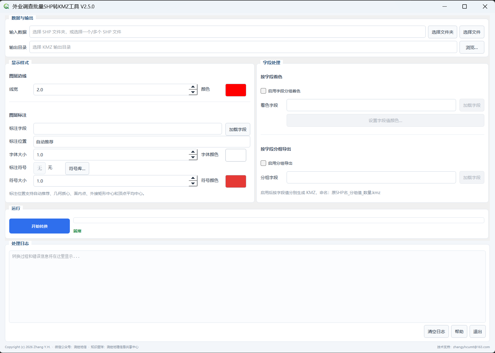

# SHP2KMZ Tool


**English | [简体中文](README_ZH.md)**

A desktop utility for batch Shapefile-to-KMZ conversion, designed for field survey preparation and GIS data review.

**SHP2KMZ Tool V2.5.0** is developed with Python and PyQt5. It keeps the core batch conversion, field-based coloring, grouped export and polygon labeling workflows from V2.4, while redesigning the interface, symbol system and label-position controls. Starting with V2.5.0, the Python source code is publicly available.

> **Latest release: [SHP2KMZ Tool V2.5.0](https://github.com/zhangyhrs/SHP2KMZ_Tool/releases/tag/v2.5.0)**  
> **Windows download: [SHP2KMZ_Tool_V2.5.0.zip](https://github.com/zhangyhrs/SHP2KMZ_Tool/releases/download/v2.5.0/SHP2KMZ_Tool_V2.5.0.zip)**  
> **Source: [`SHP2KMZ_Tool_V2.5.0.py`](SHP2KMZ_Tool_V2.5.0.py)**

## Application Interface



## Features

- Batch conversion from one, multiple, or a folder of Shapefiles to KMZ.
- CRS handling and conversion to CGCS2000 geographic coordinates, including GDAL 3+ traditional GIS axis order.
- Configurable polygon outline width and color.
- Field-based outline coloring with per-value color mapping.
- Grouped KMZ export by attribute value.
- Label field, text size and text color controls.
- Built-in point symbol library with configurable symbol color and size.
- Offline symbol packaging: symbols are rendered as PNG and embedded in the KMZ.
- Five label-position modes: Auto, Centroid, Point on Surface, Envelope Center and Vertex Average Center.
- Background conversion using QThread with progress and logs.

## What's new in V2.5.0

- PyQt5-based responsive interface.
- Visual symbol library.
- Symbol color and scale controls.
- Local/offline KMZ symbol embedding.
- Multiple label-position algorithms.
- Copyright notice in source code and application UI.
- Public Python source release.

## Run from source

Recommended: Python 3.8+.

Main dependencies:

```text
PyQt5
GDAL
```

GDAL is best installed through Conda or an OSGeo-compatible environment so the native GDAL library and Python bindings match.

Run:

```bash
python SHP2KMZ_Tool_V2.5.0.py
```

Place `icon.png` next to the script if you want the custom application icon. The program still runs if the file is absent.

## Download

### Windows release

The current stable release is **V2.5.0**.

Download:

[SHP2KMZ_Tool_V2.5.0.zip](https://github.com/zhangyhrs/SHP2KMZ_Tool/releases/download/v2.5.0/SHP2KMZ_Tool_V2.5.0.zip)

Extract the ZIP and run the EXE directly. No separate Python installation is required.

Release notes:

[Release v2.5.0](https://github.com/zhangyhrs/SHP2KMZ_Tool/releases/tag/v2.5.0)

### Source code

For learning, modification or secondary development, use:

[`SHP2KMZ_Tool_V2.5.0.py`](SHP2KMZ_Tool_V2.5.0.py)

### Historical version

The V2.4 Windows package remains available:

[`downloads/SHP2KMZ_Tool_v2.4.rar`](downloads/SHP2KMZ_Tool_v2.4.rar)

## Data preparation

Keep matching `.shp`, `.shx` and `.dbf` files together. Retain `.prj` and `.cpg` when available. Verify the actual source CRS before conversion.

## License and copyright

Copyright (c) 2026 Zhang Y.H.

The V2.5.0 source code is released under the **GNU General Public License v3.0 (GPL-3.0)**. See [LICENSE](LICENSE).

Third-party dependencies remain subject to their own licenses. References to ArcGIS/Esri describe GIS-style symbol-library interaction only; this repository does not distribute ArcGIS/Esri original symbol assets.

Users are responsible for ensuring that source geospatial data may legally be processed, copied, shared, or published.

## Issues

Please report bugs via [Issues](https://github.com/zhangyhrs/SHP2KMZ_Tool/issues) with the application version, Windows/Python/GDAL versions, reproduction steps and redacted logs or screenshots. Do not post confidential survey data, credentials or personal information.

## Changelog

See [CHANGELOG.md](CHANGELOG.md).

## Follow & Connect

Follow **测绘地信** for surveying, remote sensing and GIS content, or visit the **测绘地理信息共享中心** community.

<table>
  <tr>
    <th width="33%">WeChat Official Account<br>微信公众号：测绘地信</th>
    <th width="33%">WeChat Mini Program<br>微信小程序：测绘地信</th>
    <th width="33%">Knowledge Planet<br>知识星球：测绘地理信息共享中心</th>
  </tr>
  <tr>
    <td align="center" valign="middle"></td>
    <td align="center" valign="middle"></td>
    <td align="center" valign="middle"></td>
  </tr>
</table>

## Author

**Zhang Y.H.** · GitHub [@zhangyhrs](https://github.com/zhangyhrs)
